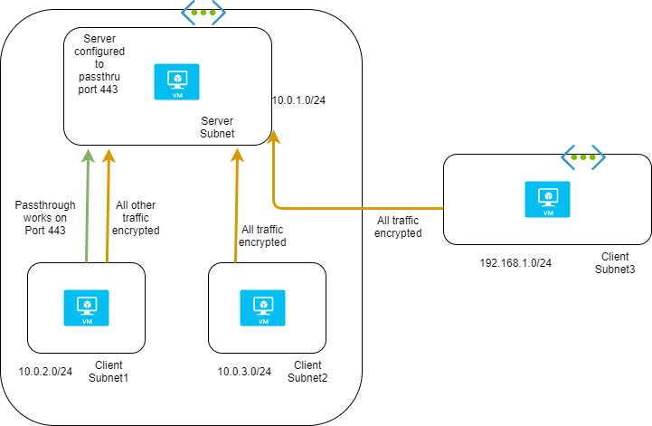

strongSwan allows to bypass certain port/protocol from encryption. This can be useful for services like HTTPS which are already encrypted using SSL/TLS and need not be re-encrypted using IPsec.
Following diagram shows scenario-based port/protocol exclusion 
- Server is configured to passthru port 443
- Clients with connection settings targeting server and port 443 are allowed communication without encryption
- All other traffic from this same client goes encrypted
- Rest of the VMs communicating with server communicate over encrypted channel

 
 

Code snippet for port/protocol exclusion

Server:
```
conn pass-ssh
        authby=never
        leftsubnet=0.0.0.0/0[tcp/22]
        rightsubnet=0.0.0.0/0[tcp]
        type=pass
        auto=route

conn pass-http
        leftsubnet=10.0.1.4/32[tcp/80]
        rightsubnet=10.0.0.0/8
        type=passthrough
        auto=route

conn trap-any
        left=%any
        right=%any
        rightsubnet=10.0.0.0/8,192.168.1.0/24
        type=transport
        authby=psk
        auto=route
```

Client: 
```
conn pass-ssh
        authby=never
        leftsubnet=10.0.0.0/8[tcp/22]
        rightsubnet=0.0.0.0/0[tcp]
        type=pass
        auto=route


conn pass-http
        rightsubnet=10.0.1.4/32[tcp/80]
        left=127.0.0.1
        type=passthrough
        auto=route

conn trap-any
        left=%any
        right=%any
        rightsubnet=10.0.0.0/8
        type=transport
        authby=psk
        auto=route
```